# Brownfield Project Guide

How to use AI1 Skills when integrating into an existing Python (FastAPI) + React codebase. Unlike greenfield, you start by understanding what exists, then adopt skills incrementally where they add the most value.

## Workflow Overview

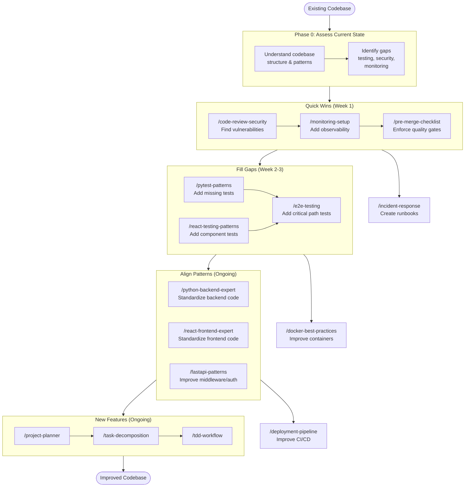

## Key difference from greenfield

In a greenfield project, you follow phases 1-8 in order. In a brownfield project, you:

1. **Start with operations and review skills** — they provide immediate value without changing existing code
2. **Fill testing gaps** — add coverage to existing code before modifying it
3. **Adopt implementation skills gradually** — apply patterns to new code, refactor old code incrementally
4. **Use planning skills for new features** — not for understanding existing code

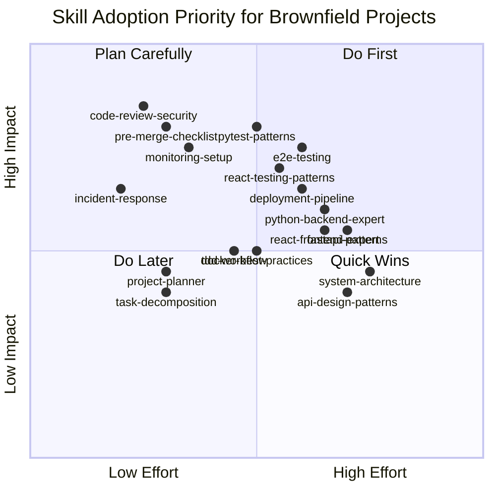

---

## Step-by-step guide

### Step 0: Install and assess

Install the skills:

```bash
npx skills add hieutrtr/ai1-skills
```

Before using any implementation skills, understand your codebase's current state. Don't let skills impose patterns that conflict with existing conventions.

**Understand the existing structure:**

```
Explain the project structure — what frameworks are used, how code is organized,
what patterns exist for the backend and frontend.
```

**Identify gaps:**

```
What testing, security, and monitoring gaps exist in this codebase?
```

Document what you find. This assessment determines which skills to adopt first.

---

### Step 1: Quick wins — security and observability

These skills are read-only or additive. They don't change existing code patterns, so there's zero risk of breaking things.

#### Security audit

```
/code-review-security Audit the entire codebase for security vulnerabilities
```

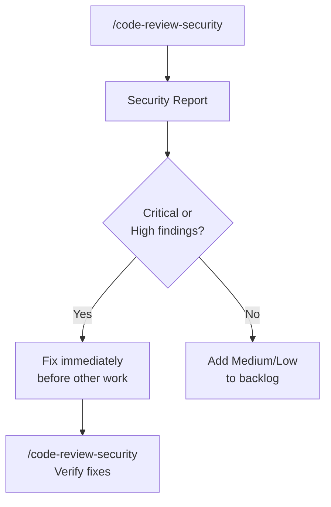

**What happens:** Claude scans for OWASP Top 10 vulnerabilities — SQL injection in raw queries, XSS via `dangerouslySetInnerHTML`, hardcoded secrets, missing auth checks, insecure dependencies. Produces a prioritized findings report.

**Action:** Fix Critical and High findings immediately. Track Medium and Low in your backlog.

#### Add monitoring

```
/monitoring-setup Add structured logging and health check endpoints to the existing API
```

**What happens:** Claude adds structlog configuration, request ID propagation middleware, `/health` and `/ready` endpoints, and Prometheus metrics — all additive, no existing code modified.

**Why first:** You need observability before making changes. If something breaks during the brownfield adoption, you need logs and metrics to diagnose it.

#### Create runbooks

```
/incident-response Create runbooks for this service based on its dependencies
```

**What happens:** Claude analyzes your service's dependencies (database, Redis, external APIs) and creates runbooks for common failure modes with diagnostic commands specific to your setup.

---

### Step 2: Enforce quality gates

Once monitoring is in place, set up quality gates for all future changes:

```
/pre-merge-checklist Set up the pre-merge validation process
```

**What happens:** Claude configures the automated check sequence (ruff, mypy, pytest, tsc, eslint, coverage thresholds) and provides the manual review checklist. From this point, every PR goes through the gate.

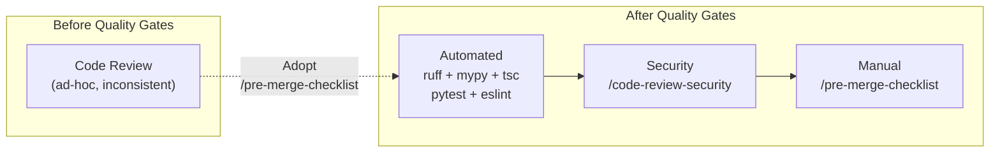

**Key point:** Apply quality gates to new changes only. Don't try to fix every existing lint error at once — that creates a massive, unreviable PR.

---

### Step 3: Fill testing gaps

Before refactoring or modifying existing code, add test coverage to protect against regressions.

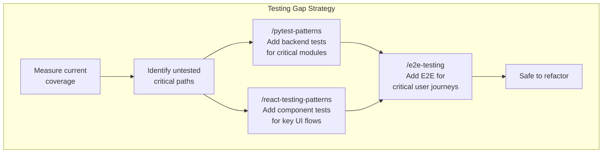

**Start with the most critical, least tested code:**

```
/pytest-patterns Write integration tests for the authentication endpoints
```

```
/pytest-patterns Write tests for the payment service — focus on edge cases
```

**What happens:** Claude uses your existing test setup (or creates `conftest.py` if missing), follows the fixture architecture pattern, creates factories for test data, and writes tests that cover happy paths and edge cases.

**For frontend:**

```
/react-testing-patterns Write tests for the Dashboard and UserProfile components
```

**For critical user flows:**

```
/e2e-testing Write E2E tests for the login → create project → add task flow
```

**Target:** Get critical paths to 80%+ coverage before doing any refactoring.

#### Coverage-first approach

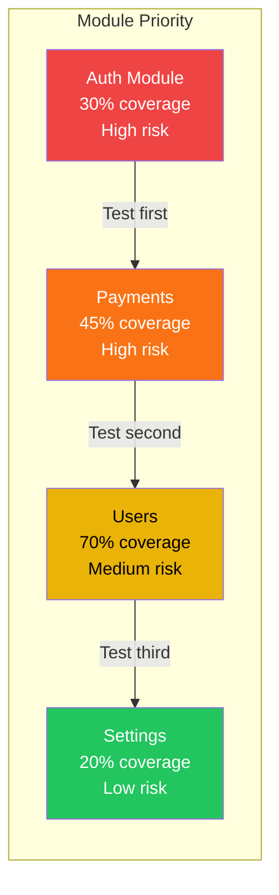

Prioritize by: `risk × (100% - current_coverage)`. High-risk, low-coverage modules first.

---

### Step 4: Standardize new code

Once quality gates and tests are in place, apply implementation skills to **new code only**. Don't rewrite existing code to match patterns — let patterns spread naturally as you add features and fix bugs.

**For new backend features:**

```
/python-backend-expert Add a notifications service with endpoints for user preferences
```

**What happens:** Claude follows the standardized pattern (repository → service → router) even if existing code doesn't. New code becomes the reference pattern for the team.

**For new frontend features:**

```
/react-frontend-expert Build the notification settings page
```

**What happens:** Claude follows the component structure, TanStack Query patterns, and accessibility requirements — even if existing components don't.

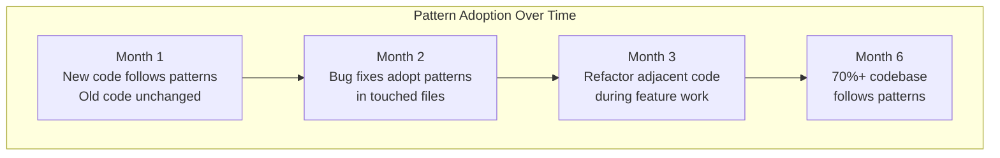

#### The Boy Scout Rule

When you touch existing code (bug fix, feature addition), improve the file you're in:

```
/python-backend-expert Refactor the user service to use the repository pattern
while fixing the duplicate email bug
```

This spreads patterns gradually without dedicated refactoring sprints.

---

### Step 5: Adopt TDD for new work

Once the team is comfortable with the testing skills, adopt TDD for new features:

```
/tdd-workflow Implement the notification delivery system using TDD
```

**What happens:** Claude writes a failing test first, implements the minimum to pass, then refactors. This ensures new features have test coverage from the start.

**Don't force TDD on bug fixes in untested code.** Instead:

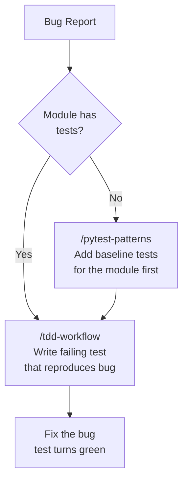

---

### Step 6: Improve infrastructure gradually

These skills apply when you're ready to improve the deployment and containerization setup:

**If Dockerfiles exist but are suboptimal:**

```
/docker-best-practices Review and optimize the existing Dockerfiles
```

**What happens:** Claude analyzes your Dockerfiles for common issues — missing multi-stage builds, root user, bloated images, poor layer caching — and suggests improvements.

**If CI/CD exists but is incomplete:**

```
/deployment-pipeline Review the CI/CD pipeline and add missing stages
```

**What happens:** Claude identifies gaps (missing security scanning, no staging environment, no canary rollout, no rollback procedure) and adds the missing stages.

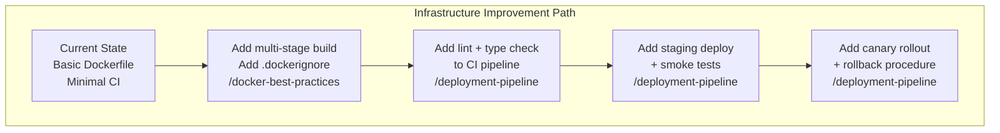

---

### Step 7: Use planning for new features

Once the codebase is stabilized with tests, quality gates, and monitoring, use planning skills for new feature development:

```
/project-planner Add a real-time collaboration feature to the task board
```

```
/task-decomposition Break down the collaboration feature into tasks
```

**This is the same as greenfield** from this point on — plan, design, implement (with TDD), review, deploy. The difference is that you now have an existing codebase with patterns and tests to guide new work.

---

## Brownfield adoption timeline

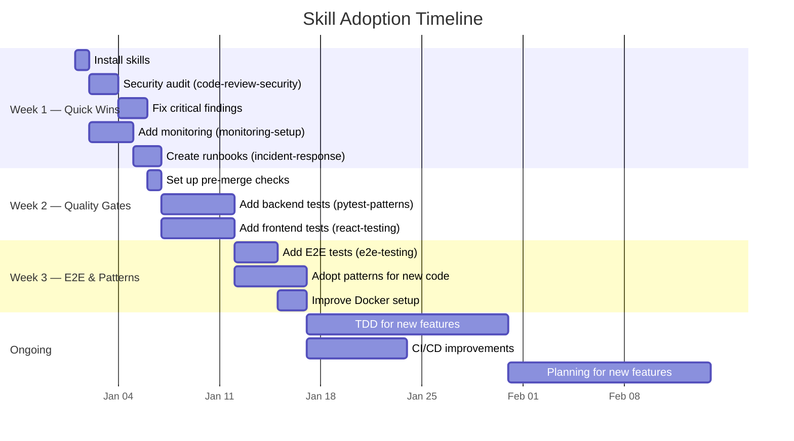

---

## Brownfield checklist

Track your adoption progress:

```
## Phase 0: Assessment
- [ ] Codebase structure understood
- [ ] Existing patterns documented
- [ ] Testing gaps identified
- [ ] Security risks cataloged
- [ ] Monitoring gaps identified

## Phase 1: Quick Wins (no code changes to existing patterns)
- [ ] Security audit completed with /code-review-security
- [ ] Critical and High findings fixed
- [ ] Structured logging added with /monitoring-setup
- [ ] Health check endpoints added
- [ ] Runbooks created with /incident-response

## Phase 2: Quality Gates
- [ ] Pre-merge checks configured with /pre-merge-checklist
- [ ] CI pipeline runs linting + type checks
- [ ] Coverage thresholds set (start low, increase over time)

## Phase 3: Testing Gaps
- [ ] Critical backend paths tested with /pytest-patterns
- [ ] Key frontend components tested with /react-testing-patterns
- [ ] Critical user journeys covered with /e2e-testing
- [ ] Coverage above 60% on critical modules

## Phase 4: Pattern Adoption
- [ ] New backend code follows /python-backend-expert patterns
- [ ] New frontend code follows /react-frontend-expert patterns
- [ ] Existing code improved via Boy Scout Rule (when touched)

## Phase 5: Full SDLC (new features)
- [ ] TDD adopted for new features with /tdd-workflow
- [ ] Planning skills used for feature work
- [ ] Docker optimized with /docker-best-practices
- [ ] CI/CD improved with /deployment-pipeline
```

---

## Common mistakes in brownfield adoption

### Mistake 1: Rewriting everything at once

**Wrong:** "Refactor the entire backend to use the repository pattern"

**Right:** "Use the repository pattern for the new notifications module. Migrate the user module when we fix the duplicate email bug."

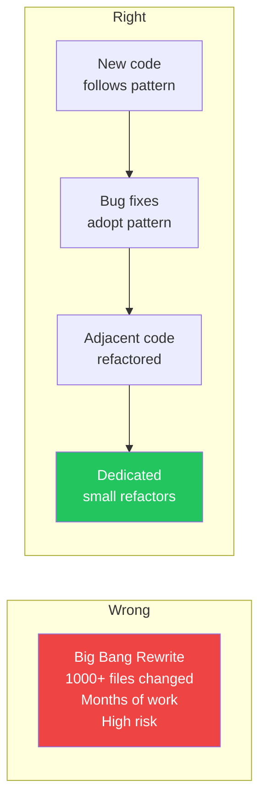

### Mistake 2: Adding tests without understanding existing behavior

**Wrong:** Writing tests based on what you think the code should do.

**Right:** Read the code first, write tests that verify what it actually does, then fix discrepancies.

```
# Right approach
/pytest-patterns Write characterization tests for the payment service
— test what it currently does, document any surprising behavior
```

### Mistake 3: Skipping the security audit

**Wrong:** "We'll do security review later, let's focus on features."

**Right:** Security audit is the first thing you do. It's read-only, low-effort, and may reveal issues that need immediate attention.

### Mistake 4: Applying all quality gates retroactively

**Wrong:** Running `mypy --strict` on a codebase with zero type annotations and trying to fix 2,000 errors.

**Right:** Enable strict checking for new files only. Use a `mypy.ini` that excludes legacy modules:

```ini
[mypy]
strict = true

[mypy-legacy_module.*]
ignore_errors = true
```

Gradually remove exclusions as you add type annotations during regular work.
