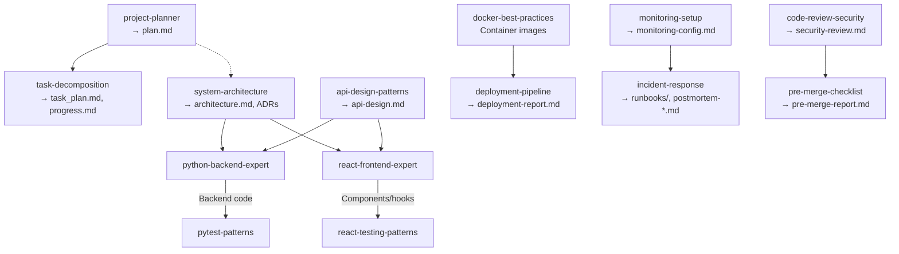
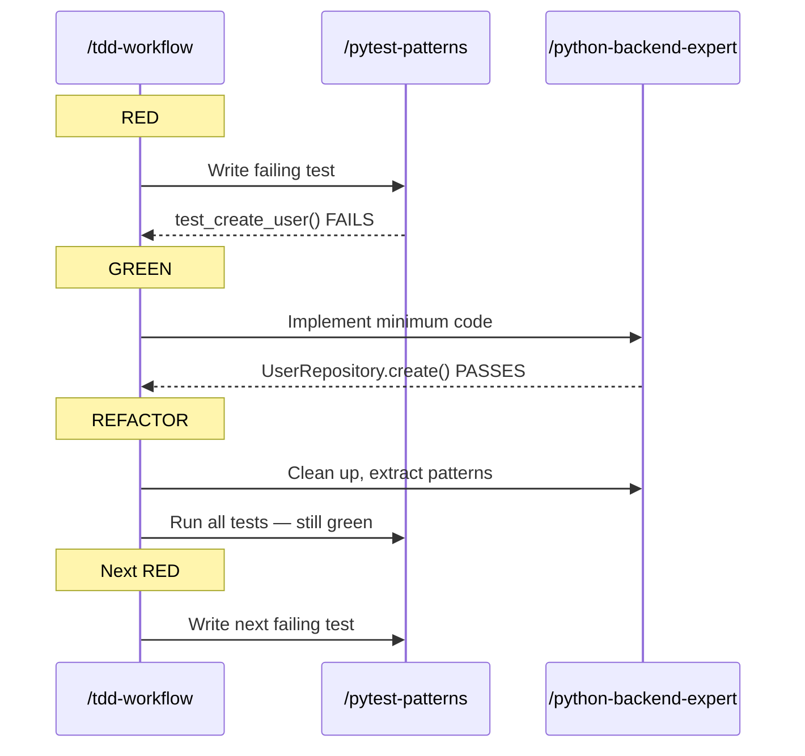
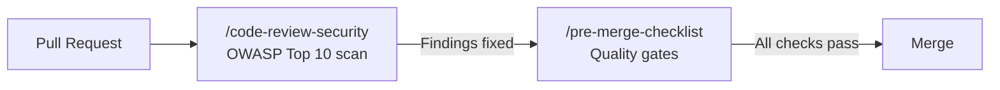
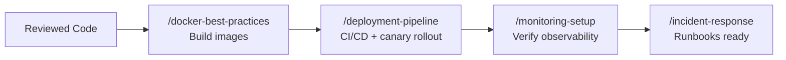
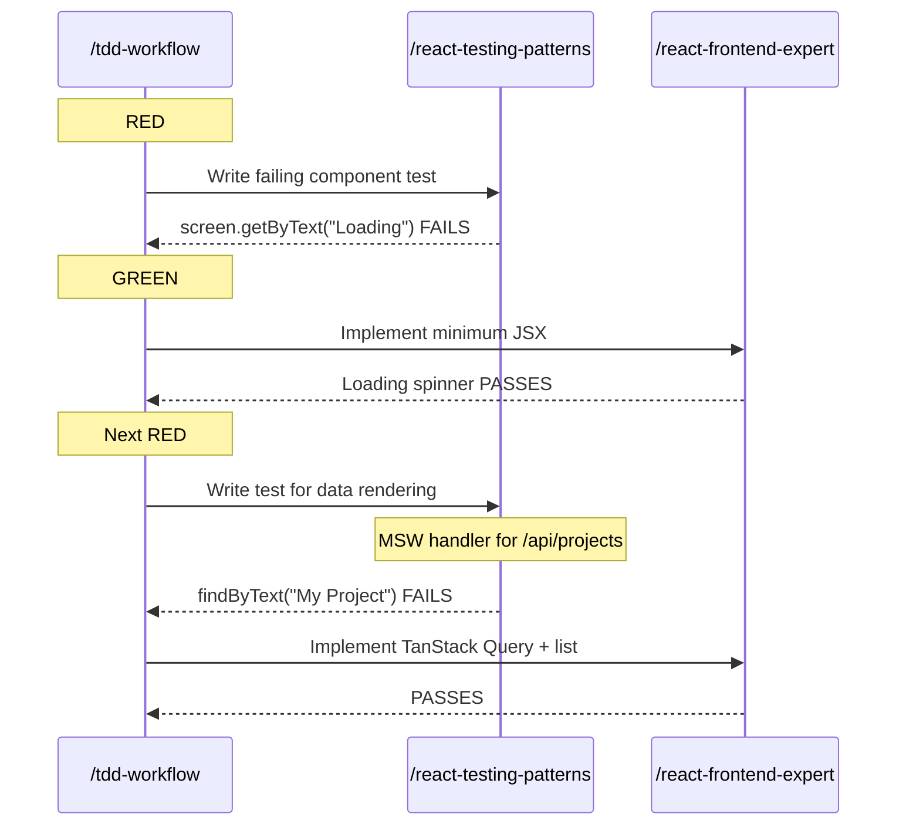

# Skill Composition Guide

> **[README](../README.md)** | [Greenfield Guide](greenfield.md) | [Brownfield Guide](brownfield.md)

How the 17 AI1 Skills relate to each other — activation rules, artifact flow between skills, same-phase pairings, and when *not* to use a skill.

## How Skills Activate

Skills activate based on keywords in your prompt. Each skill's `description` field contains phase-specific keywords and negative keywords ("Does NOT cover...") that help Claude pick the right one.

### Activation Examples

| Prompt Pattern | Activates | Does NOT Activate |
|---------------|-----------|-------------------|
| "plan the user auth feature" | `project-planner` | task-decomposition, system-architecture |
| "break this down into tasks" | `task-decomposition` | project-planner |
| "design the database schema" | `system-architecture` | python-backend-expert, api-design-patterns |
| "design the API contract for users" | `api-design-patterns` | system-architecture, python-backend-expert |
| "create a FastAPI endpoint for users" | `python-backend-expert` | fastapi-patterns, api-design-patterns |
| "configure CORS middleware" | `fastapi-patterns` | python-backend-expert |
| "set up JWT authentication dependency" | `fastapi-patterns` | python-backend-expert, code-review-security |
| "build a React user profile component" | `react-frontend-expert` | react-testing-patterns |
| "write tests for UserProfile component" | `react-testing-patterns` | react-frontend-expert, e2e-testing |
| "use TDD to build the payment service" | `tdd-workflow` | pytest-patterns, python-backend-expert |
| "write pytest tests for UserService" | `pytest-patterns` | react-testing-patterns, tdd-workflow |
| "write E2E test for login flow" | `e2e-testing` | pytest-patterns, react-testing-patterns |
| "review this PR for security" | `code-review-security` | pre-merge-checklist |
| "check if this PR is ready to merge" | `pre-merge-checklist` | code-review-security |
| "deploy to production" | `deployment-pipeline` | docker-best-practices |
| "optimize the Dockerfile" | `docker-best-practices` | deployment-pipeline |
| "we have a production outage" | `incident-response` | monitoring-setup |
| "set up Prometheus metrics" | `monitoring-setup` | incident-response |
| "add a WebSocket endpoint" | `fastapi-patterns` | python-backend-expert |
| "add structured logging" | `monitoring-setup` | python-backend-expert |
| "create GitHub Actions workflow" | `deployment-pipeline` | docker-best-practices |

**Tip:** If Claude activates the wrong skill, add clarifying keywords. For example, "create a FastAPI endpoint" activates `python-backend-expert`, while "configure FastAPI middleware" activates `fastapi-patterns`.

---

## Skill Relationships

### Vertical Composition (Producer → Consumer)

Skills pass artifacts down the SDLC. A producer skill's output file becomes the input for a consumer skill.

| Producer | Output File | Consumer |
|----------|-------------|----------|
| `project-planner` | `plan.md` | `task-decomposition`, `system-architecture` (optional), `api-design-patterns` (optional) |
| `task-decomposition` | `task_plan.md`, `progress.md`, `findings.md` | Implementation skills (contextual) |
| `system-architecture` | `architecture.md`, `docs/adr/ADR-NNN.md` | `python-backend-expert`, `react-frontend-expert`, `api-design-patterns` |
| `api-design-patterns` | `api-design.md` | `python-backend-expert`, `react-frontend-expert` |
| `code-review-security` | `security-review.md` | `pre-merge-checklist` |
| `pre-merge-checklist` | `pre-merge-report.md` | Merge decision |
| `deployment-pipeline` | `deployment-report.md` | Operations tracking |
| `monitoring-setup` | `monitoring-config.md` | `incident-response` |
| `incident-response` | `docs/runbooks/<service>.md`, `postmortem-YYYY-MM-DD.md` | Future incidents, team knowledge |

### Horizontal Composition (Same-Phase Pairing)

Some skills operate in parallel within the same phase. They have non-overlapping scopes and complement each other.

| Phase | Skill A | Skill B | How They Pair |
|-------|---------|---------|---------------|
| Architecture | `system-architecture` (system-level) | `api-design-patterns` (API contracts) | Architecture decisions inform API design |
| Backend Implementation | `python-backend-expert` (app patterns) | `fastapi-patterns` (framework mechanics) | CRUD vs middleware/auth/WebSocket |
| Testing | `pytest-patterns` (backend) | `react-testing-patterns` (frontend) | Same phase, different stacks |
| Testing | `pytest-patterns` (unit/integration) | `e2e-testing` (browser E2E) | Different test levels |
| Testing | `tdd-workflow` (methodology) | any testing skill (patterns) | TDD drives; testing skill provides patterns |
| Code Review | `code-review-security` (security) | `pre-merge-checklist` (quality) | Security + quality gates together |
| Deployment | `deployment-pipeline` (CI/CD) | `docker-best-practices` (containers) | Containers feed into pipelines |
| Operations | `incident-response` (incidents) | `monitoring-setup` (observability) | Monitoring enables incident diagnosis |

---

## When NOT to Use a Skill

Each skill has explicit negative keywords — things it does *not* handle. If your request falls outside a skill's scope, use the alternative listed below.

| Skill | Does NOT Handle | Use Instead |
|-------|----------------|-------------|
| `project-planner` | Architecture decisions, code implementation | `system-architecture`, `python-backend-expert` |
| `task-decomposition` | High-level planning, architecture | `project-planner`, `system-architecture` |
| `system-architecture` | Implementation code, API contracts | `python-backend-expert`, `api-design-patterns` |
| `api-design-patterns` | Implementation code, system architecture | `python-backend-expert`, `system-architecture` |
| `python-backend-expert` | Testing, middleware/WebSockets | `pytest-patterns`, `fastapi-patterns` |
| `fastapi-patterns` | Basic CRUD, repository/service patterns | `python-backend-expert` |
| `react-frontend-expert` | Testing, E2E, backend | `react-testing-patterns`, `e2e-testing` |
| `react-testing-patterns` | E2E browser tests, backend tests | `e2e-testing`, `pytest-patterns` |
| `tdd-workflow` | Testing patterns (how to write tests) | `pytest-patterns`, `react-testing-patterns` |
| `pytest-patterns` | Frontend tests, E2E tests | `react-testing-patterns`, `e2e-testing` |
| `e2e-testing` | Unit tests, component tests | `pytest-patterns`, `react-testing-patterns` |
| `code-review-security` | Deployment security, quality metrics | `docker-best-practices`, `pre-merge-checklist` |
| `pre-merge-checklist` | Security-specific review (OWASP depth) | `code-review-security` |
| `deployment-pipeline` | Docker image building, incident response | `docker-best-practices`, `incident-response` |
| `docker-best-practices` | Deployment orchestration, CI/CD | `deployment-pipeline` |
| `incident-response` | Monitoring setup, deployment | `monitoring-setup`, `deployment-pipeline` |
| `monitoring-setup` | Incident response, deployment | `incident-response`, `deployment-pipeline` |

---

## Common Multi-Skill Workflows

### Backend TDD Workflow

Three skills collaborate on each unit of backend work:

### Security Review Before Merge

Two code review skills run in sequence:

### Full Deployment Sequence

### Frontend TDD Workflow

---

## MCP Server Integration

Skills become more powerful when paired with MCP servers that provide live data access:

| Skill | MCP Server | What It Enables |
|-------|------------|-----------------|
| `project-planner` | Jira MCP | Create issues, query backlog, link tasks to plan |
| `task-decomposition` | Jira MCP | Create subtasks, track decomposed items |
| `python-backend-expert` | PostgreSQL MCP | Query database for schema inspection during implementation |
| `pytest-patterns` | CI Server MCP | Trigger test runs, fetch coverage reports |
| `code-review-security` | GitHub MCP | Fetch PR diffs, post review comments, check CI status |
| `pre-merge-checklist` | GitHub MCP | Verify CI checks, fetch PR metadata |
| `deployment-pipeline` | GitHub MCP, Kubernetes MCP | Trigger deploys, check pod status, manage rollbacks |
| `incident-response` | Datadog/PagerDuty MCP | Query metrics, check alerts, manage incidents |
| `monitoring-setup` | Datadog MCP | Configure dashboards, verify alert rules |
