# Greenfield Project Guide

How to use AI1 Skills when starting a new Python (FastAPI) + React project from scratch. Tests drive implementation — every feature is built through the Red-Green-Refactor cycle.

## Workflow Overview

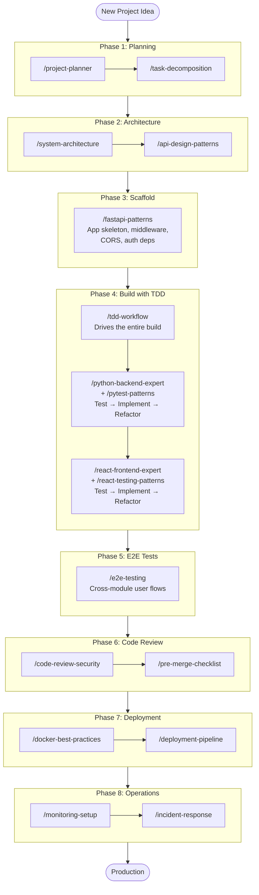

The critical difference from a waterfall-style SDLC: **there is no separate "implementation" phase followed by a "testing" phase.** Implementation and testing happen together in Phase 4. Every line of production code is written to make a failing test pass.

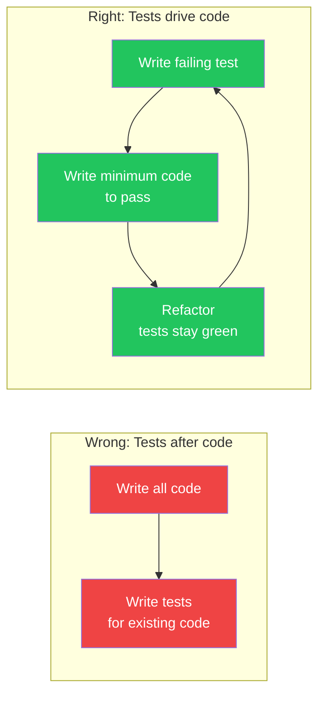

---

## Step-by-step guide

### Step 0: Install skills

```bash
npx skills add hieutrtr/ai1-skills
```

Verify:

```
> What skills are available?
```

---

### Step 1: Plan the project

Start with the big picture. The planning skills produce documents, not code.

```
/project-planner Build a task management API with user auth, projects, and tasks
```

**What happens:** Claude analyzes your requirement, identifies modules (auth, projects, tasks), maps file paths, defines acceptance criteria, and produces a structured plan with dependencies.

**Output:** A plan document listing subtasks, affected files, verification steps, and risks.

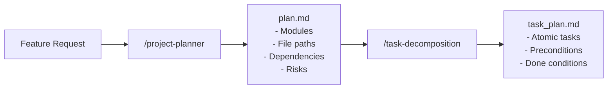

Next, decompose the plan into atomic tasks:

```
/task-decomposition Break down the project plan into implementation tasks
```

**What happens:** Each high-level item becomes 2-5 atomic tasks. Each task touches at most 2-3 files, has a single outcome, and includes a verification command.

**Review the output** before moving on. Reorder tasks if needed. The task list becomes your implementation roadmap.

---

### Step 2: Design the architecture

With the plan in hand, make architectural decisions before writing any code.

```
/system-architecture Design the layer architecture for the task management API
```

**What happens:** Claude walks through the Router → Service → Repository → Model → Schema layers, defines component boundaries, plans the database schema, and documents decisions as ADRs.

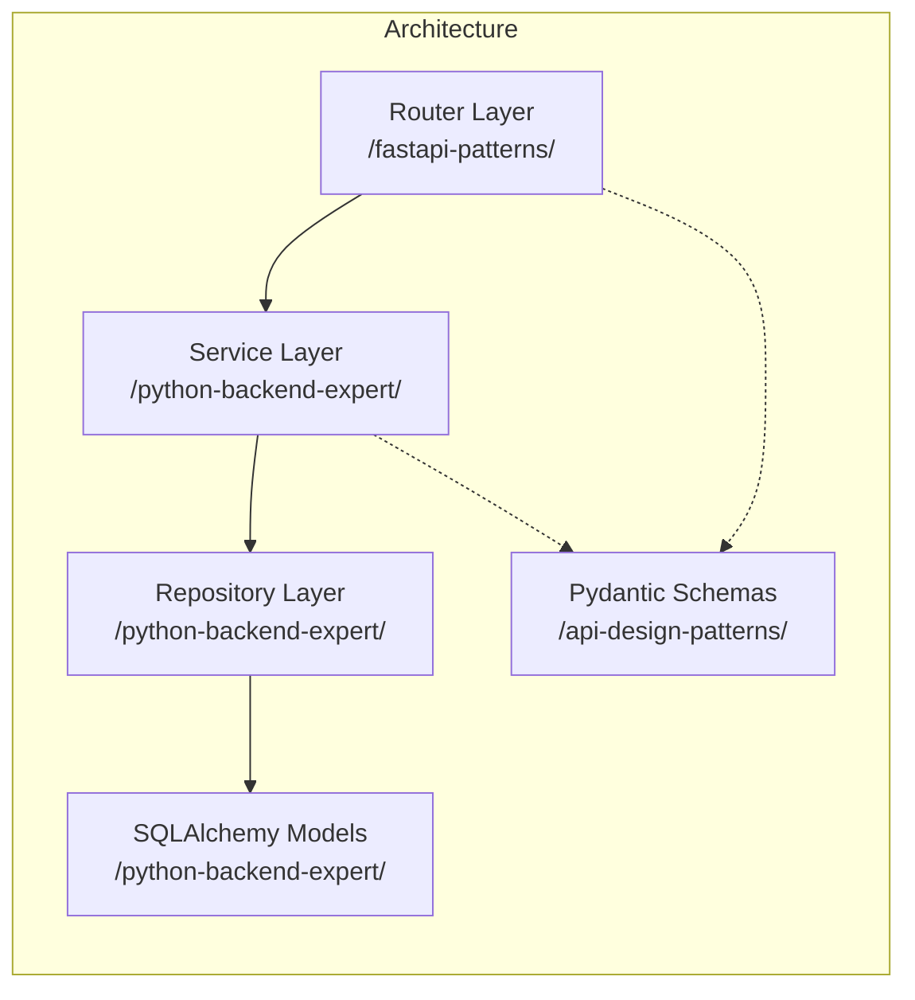

Then design the API contracts:

```
/api-design-patterns Design the REST API for projects and tasks
```

**What happens:** Claude produces endpoint definitions following your conventions — URL naming, HTTP methods, status codes, Pydantic request/response schemas, pagination pattern, and error format.

**Key outputs at this stage:**
- Architecture Decision Records (ADRs)
- Database schema plan (tables, relationships, indexes)
- API endpoint catalog (URL, method, request/response schemas)
- Component diagram showing service boundaries

---

### Step 3: Scaffold the project

Set up the project skeleton — the infrastructure that doesn't need TDD. This is configuration, not feature code.

```
/fastapi-patterns Set up the FastAPI application with middleware, CORS, auth dependencies, and database session management
```

**What this covers:**
- FastAPI app creation with lifespan
- Middleware stack (logging, CORS, error handling)
- `get_async_session` dependency
- Auth dependencies (`get_current_user`, `require_role`)
- Alembic configuration
- Project directory structure

**What this does NOT cover:** Any feature endpoints, models, or business logic. Those are built through TDD in the next phase.

---

### Step 4: Build with TDD

This is the core of greenfield development. Every feature — backend and frontend — is built through the Red-Green-Refactor cycle. Testing and implementation are not separate activities.

#### How TDD works with the skills

Three skills work together for each unit of work:

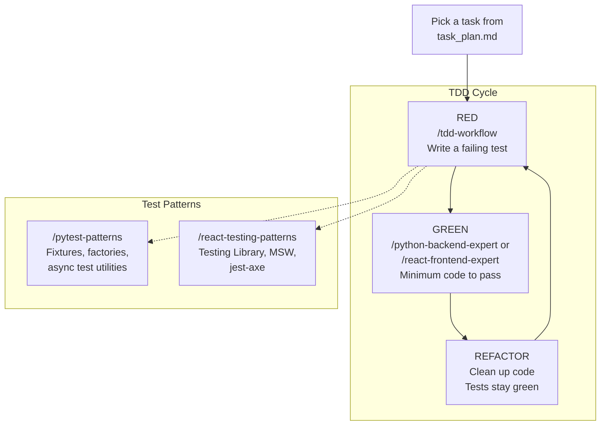

- `/tdd-workflow` controls the cycle — it enforces writing a failing test before any production code
- `/pytest-patterns` or `/react-testing-patterns` provide the test patterns (fixtures, factories, MSW handlers)
- `/python-backend-expert` or `/react-frontend-expert` provide the implementation patterns (repository, service, component structure)

#### Backend: build each module with TDD

Build backend modules one at a time. For each module, the cycle is: test the repository → implement it → test the service → implement it → test the router → implement it.

```
/tdd-workflow Build the User module with registration and login — start with tests
```

**What happens step by step:**

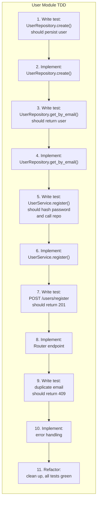

Then continue for each module:

```
/tdd-workflow Build the Project module with CRUD — start with tests
```

```
/tdd-workflow Build the Task module with CRUD and assignment — start with tests
```

Claude uses `/pytest-patterns` for test infrastructure (conftest fixtures, factories, `httpx.AsyncClient`) and `/python-backend-expert` for implementation patterns (repository, service layer, Pydantic schemas, Alembic migrations).

#### Frontend: build each page/component with TDD

Same cycle for frontend. Test first, then implement:

```
/tdd-workflow Build the ProjectList page — start with component tests
```

**What happens:**

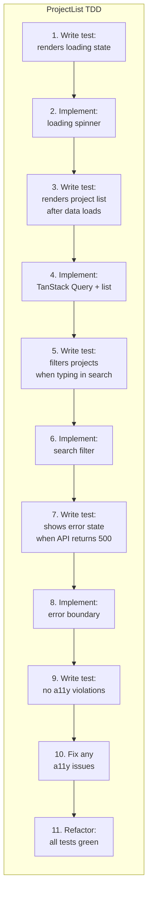

```
/tdd-workflow Build the TaskBoard component — start with tests
```

Claude uses `/react-testing-patterns` for test infrastructure (Testing Library queries, MSW handlers, `userEvent`, `jest-axe`) and `/react-frontend-expert` for implementation patterns (component structure, TanStack Query, forms, accessibility).

#### What "minimum code to pass" means

This is the most important discipline. In the GREEN step, you write only enough code to make the current failing test pass. Nothing more.

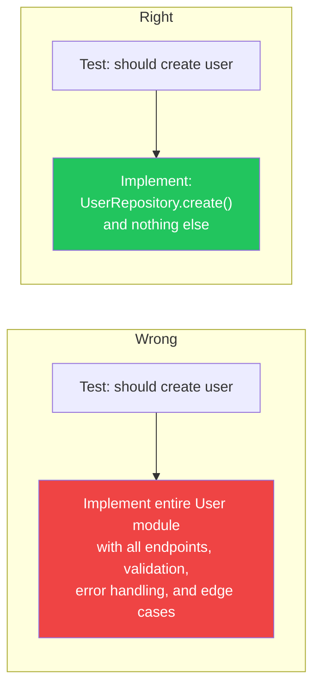

---

### Step 5: E2E tests for cross-module flows

After individual modules are built and unit/integration tested through TDD, add E2E tests that verify complete user journeys across modules.

```
/e2e-testing Write E2E tests for the login → create project → add task flow
```

**What happens:** Claude creates Playwright tests with page object model, reliable selectors, auth state reuse, and proper wait strategies.

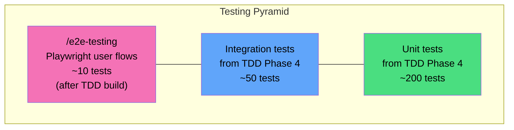

E2E tests are the only tests written after implementation. They exist at a different level — they test that separately-built modules work together as a complete system. The unit and integration tests were already written during TDD in Phase 4.

---

### Step 6: Review before merge

Before merging any feature branch, run both review skills:

```
/code-review-security Review the authentication module
```

**What happens:** Claude walks through the OWASP Top 10 checklist against your code — checking for SQL injection, XSS, broken access control, hardcoded secrets, insecure dependencies. Produces a findings report with severity, file/line, and fix recommendations.

```
/pre-merge-checklist Run all pre-merge checks
```

**What happens:** Claude runs automated checks (ruff, mypy, pytest, tsc, eslint) and walks through the manual review checklist — code quality, test coverage, API compatibility, migration safety, documentation.

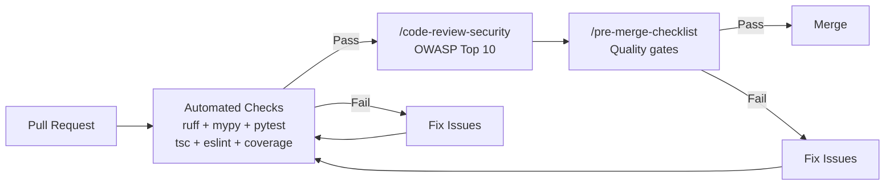

---

### Step 7: Containerize and deploy

```
/docker-best-practices Create Dockerfiles for the backend and frontend
```

**What happens:** Claude creates multi-stage Dockerfiles — builder stage for dependencies, runtime stage with non-root user, optimized layer caching, proper `.dockerignore`, and a Docker Compose file for local development.

```
/deployment-pipeline Set up the GitHub Actions CI/CD pipeline
```

**What happens:** Claude creates a pipeline with stages: lint/type-check → test → build → deploy-staging → smoke-test → deploy-production. Includes canary rollout, health check verification, and rollback procedure.

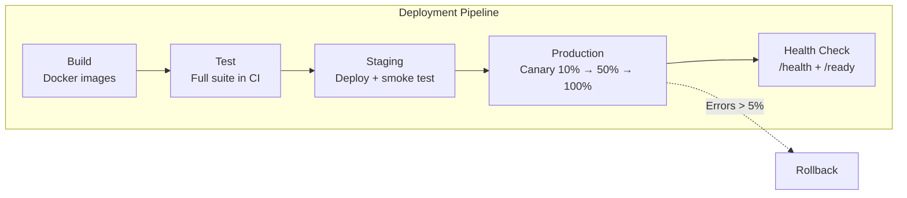

---

### Step 8: Set up observability

Before going live, make the system observable:

```
/monitoring-setup Add structured logging, Prometheus metrics, and health checks
```

**What happens:** Claude adds structlog with JSON output and request ID propagation, Prometheus middleware tracking RED metrics (Rate, Errors, Duration), liveness (`/health`) and readiness (`/ready`) endpoints, Sentry integration, and alerting rules.

```
/incident-response Create runbooks for the task management service
```

**What happens:** Claude creates service-specific runbooks covering common failure modes (database connection exhaustion, memory leaks, cascading failures) with diagnostic commands and remediation steps.

---

## How skills combine during TDD

This diagram shows which skills are active simultaneously during a single TDD cycle for a backend feature:

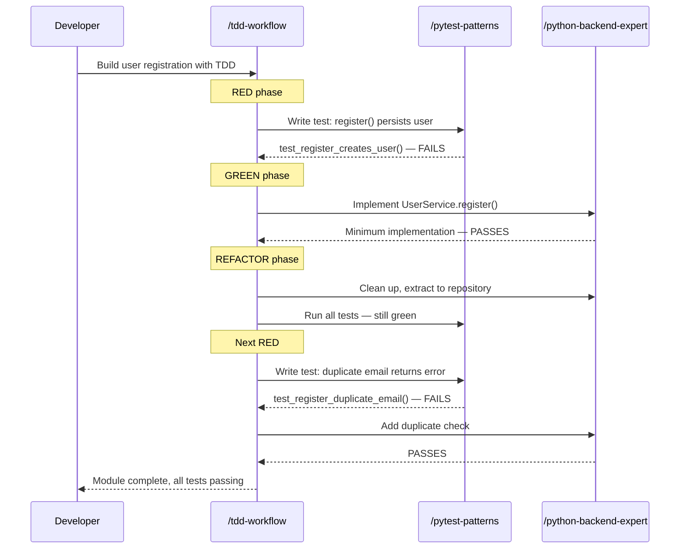

And for a frontend feature:

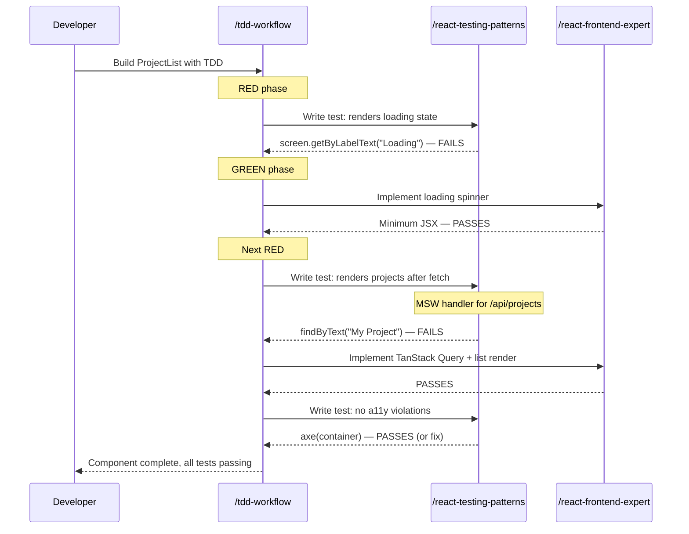

---

## Greenfield checklist

```
## Planning
- [ ] Project plan created with /project-planner
- [ ] Tasks decomposed with /task-decomposition
- [ ] Task dependencies mapped and ordered

## Architecture
- [ ] Layer architecture designed with /system-architecture
- [ ] API contracts defined with /api-design-patterns
- [ ] Database schema planned
- [ ] ADRs documented for key decisions

## Scaffold
- [ ] FastAPI app skeleton with /fastapi-patterns
- [ ] Middleware, CORS, auth dependencies configured
- [ ] Database session management set up
- [ ] Alembic initialized

## Build with TDD
- [ ] Each backend module built test-first with /tdd-workflow
  - [ ] Repository tests → implementation
  - [ ] Service tests → implementation
  - [ ] Router integration tests → implementation
- [ ] Each frontend component built test-first with /tdd-workflow
  - [ ] Component render tests → implementation
  - [ ] Interaction tests → implementation
  - [ ] Accessibility tests → fixes
- [ ] All unit and integration tests passing
- [ ] Coverage >= 80%

## E2E Tests
- [ ] Critical user flows covered with /e2e-testing
- [ ] Playwright page objects created
- [ ] Auth state reuse configured

## Code Review
- [ ] Security review passed with /code-review-security
- [ ] Pre-merge checks all green with /pre-merge-checklist

## Deployment
- [ ] Dockerfiles created with /docker-best-practices
- [ ] CI/CD pipeline configured with /deployment-pipeline
- [ ] Staging deployment verified

## Operations
- [ ] Logging, metrics, health checks with /monitoring-setup
- [ ] Alerting rules configured
- [ ] Runbooks created with /incident-response
- [ ] Production deployment verified
```

## Tips for greenfield projects

1. **Tests before code, always.** The `/tdd-workflow` skill enforces this. If you find yourself writing production code without a failing test, stop and write the test first.
2. **Scaffold is the only exception.** Project skeleton setup (middleware, CORS, session management) is infrastructure configuration — TDD doesn't apply to framework wiring. Everything after the scaffold goes through TDD.
3. **One TDD cycle per behavior.** Don't write 10 tests then implement everything. Write one test, make it pass, refactor. Then write the next test.
4. **Run security review early.** Don't wait until the end. Use `/code-review-security` after each module is complete.
5. **E2E tests come last** because they verify cross-module integration. Individual modules are already tested through TDD.
6. **Set up CI/CD before the first deploy.** Use `/deployment-pipeline` early so every commit goes through the pipeline.
